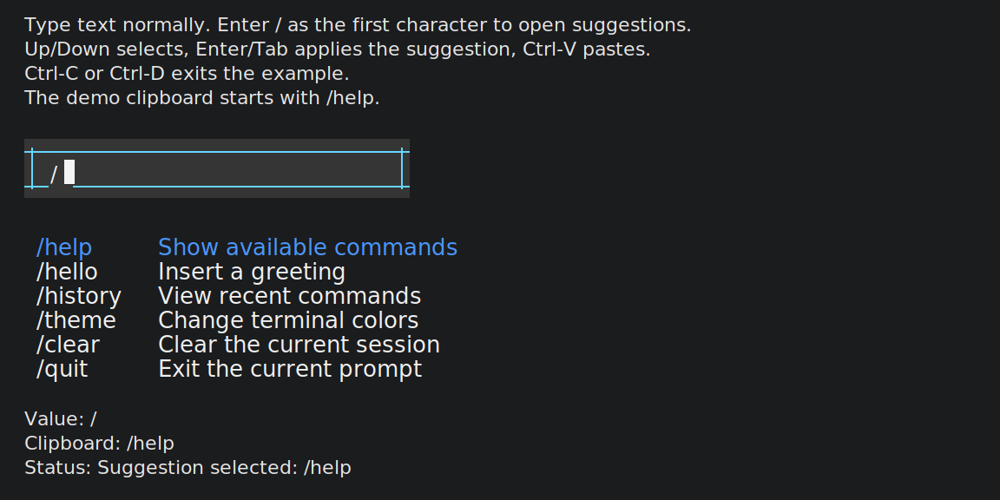

# Oxink

Oxink is a small Rust library for CLI rendering primitives and terminal input
state. It exposes ANSI style codes, foreground/background color helpers, color
conversion utilities, and a slash-command input component that are useful when
building terminal output.

## Features

- ANSI modifier styles: bold, dim, italic, underline, overline, inverse, hidden,
  strikethrough, and reset.
- ANSI foreground and background colors, including bright color variants.
- Helpers for ANSI 16-color, 256-color, and truecolor escape sequences.
- RGB and Hex conversion helpers for ANSI 256-color and ANSI 16-color output.
- `input::SlashInput` for command-style terminal inputs with dropdown options.
- Dynamic dropdown options with `command` and `description` values that can be
  replaced from outside with `set_options`.
- Input width can be overridden from outside and reset back to
  `DEFAULT_INPUT_WIDTH`.
- Input rendering themes with ANSI foreground/background colors and selected-row
  styling.
- Slash selection applies `/command ` automatically and renders the command
  segment in blue.
- Dropdown suggestions render descriptions after commands, use extra vertical
  spacing, align descriptions to the longest visible command, and default to
  white/unselected plus blue/selected text.
- Zero runtime dependencies.

## Installation

Add Oxink to your `Cargo.toml`:

```toml
[dependencies]
oxink = "0.1.1"
```

If you are using the local repository directly:

```toml
[dependencies]
oxink = { path = "path/to/Oxink" }
```

## Usage

Style output:

```rust
use oxink::styles::{ANSI_STYLES, BOLD, RED};

fn main() {
    let message = format!(
        "{}{}Error:{} something went wrong",
        BOLD.open_escape(),
        RED.open_escape(),
        RED.close_escape(),
    );

    println!("{}{}", message, BOLD.close_escape());

    let orange = ANSI_STYLES.color.ansi256(ANSI_STYLES.hex_to_ansi256("#ff8800"));
    println!("{orange}warning\x1B[39m");
}
```

Build a slash-command input:

```rust
use oxink::input::{
    DEFAULT_INPUT_WIDTH, InputAction, InputTheme, KeyCode, KeyEvent, SlashInput,
    TerminalColor,
};

let mut input = SlashInput::new([
    ("help", "Show available commands"),
    ("history", "View recent commands"),
    ("quit", "Exit the prompt"),
])
.with_input_width(Some(DEFAULT_INPUT_WIDTH + 8))
.with_theme(
    InputTheme::ocean()
        .with_background_color(TerminalColor::Ansi256(236))
        .with_selected_background_color(TerminalColor::Ansi256(31)),
);

input.handle_key(KeyEvent::plain(KeyCode::Char('/')));
input.handle_key(KeyEvent::plain(KeyCode::Char('h')));
input.handle_key(KeyEvent::plain(KeyCode::Down));

assert_eq!(
    input.handle_key(KeyEvent::plain(KeyCode::Enter)),
    InputAction::SuggestionApplied("/history ".to_string())
);
assert_eq!(input.value(), "/history ");

let view = input.render();
println!("{view}");
```

Rendered preview:



Update dropdown options from outside:

```rust
use oxink::input::{InputOption, SlashInput};

let mut input = SlashInput::new(["help", "quit"]);
input.set_options([
    ("history", "View recent commands"),
    InputOption::new("theme", "Change terminal colors"),
    ("clear", "Clear the current session"),
]);

assert_eq!(
    input
        .options()
        .iter()
        .map(|option| (option.command.as_str(), option.description.as_str()))
        .collect::<Vec<_>>(),
    vec![
        ("history", "View recent commands"),
        ("theme", "Change terminal colors"),
        ("clear", "Clear the current session"),
    ]
);
```

Configure the input width from outside:

```rust
use oxink::input::{DEFAULT_INPUT_WIDTH, SlashInput};

let mut input = SlashInput::new(["help"]).with_input_width(Some(40));
input.set_input_width(None);

let _resolved_width = DEFAULT_INPUT_WIDTH;
```

Generate escape sequences directly:

```rust
use oxink::styles::ANSI_STYLES;

let fg = ANSI_STYLES.color.ansi16m(255, 136, 0);
let bg = ANSI_STYLES.bg_color.ansi256(236);

assert_eq!(fg, "\x1B[38;2;255;136;0m");
assert_eq!(bg, "\x1B[48;5;236m");
```

Convert colors:

```rust
use oxink::styles::{hex_to_ansi, hex_to_ansi256, hex_to_rgb, rgb_to_ansi};

assert_eq!(hex_to_rgb("#abc"), [170, 187, 204]);
assert_eq!(hex_to_ansi256("#ff0000"), 196);
assert_eq!(hex_to_ansi("#ff0000"), 91);
assert_eq!(rgb_to_ansi(255, 0, 0), 91);
```

## API Overview

### Input Component

`SlashInput` is a pure state machine for terminal-style command input:

```rust
use oxink::input::{KeyCode, KeyEvent, SlashInput};

let mut input = SlashInput::new([
    ("help", "Show available commands"),
    ("history", "View recent commands"),
]);

input.handle_key(KeyEvent::plain(KeyCode::Char('/')));
input.handle_key(KeyEvent::plain(KeyCode::Char('h')));

assert!(input.is_dropdown_visible());
assert_eq!(input.filtered_commands(), vec!["help", "history"]);
assert_eq!(
    input
        .filtered_options()
        .into_iter()
        .map(|option| (option.command.as_str(), option.description.as_str()))
        .collect::<Vec<_>>(),
    vec![
        ("help", "Show available commands"),
        ("history", "View recent commands"),
    ]
);
```

The component supports:

- Normal text input, cursor movement, backspace, and delete.
- Copy and paste shortcuts via `InputAction::CopyRequested` and
  `InputAction::PasteRequested`.
- `/` as the first character to open a filtered dropdown.
- Suggestions support both `command` and `description`, and matching is done
  against the command.
- `filtered_options()` returns `InputOption` references, while
  `filtered_commands()` remains available as a command-only helper.
- `Up` and `Down` to change the highlighted option.
- `Enter` or `Tab` to apply the current option as `/command `.
- `Enter` without an open dropdown to submit and clear the input.
- `with_input_width(...)` and `set_input_width(...)` let callers override the
  default width or fall back to `DEFAULT_INPUT_WIDTH`.

`InputTheme` controls border, text, background, suggestion, and selected-row
colors. `TerminalColor` accepts ANSI 16-color, ANSI 256-color, or RGB values.

### Style Codes

`StyleCode` stores an ANSI opening code and matching closing code:

```rust
use oxink::styles::UNDERLINE;

assert_eq!(UNDERLINE.open, 4);
assert_eq!(UNDERLINE.close, 24);
assert_eq!(UNDERLINE.open_escape(), "\x1B[4m");
assert_eq!(UNDERLINE.close_escape(), "\x1B[24m");
```

Available modifier constants:

```text
RESET, BOLD, DIM, ITALIC, UNDERLINE, OVERLINE, INVERSE, HIDDEN,
STRIKETHROUGH
```

Available foreground color constants:

```text
BLACK, RED, GREEN, YELLOW, BLUE, MAGENTA, CYAN, WHITE,
BLACK_BRIGHT, GRAY, GREY, RED_BRIGHT, GREEN_BRIGHT, YELLOW_BRIGHT,
BLUE_BRIGHT, MAGENTA_BRIGHT, CYAN_BRIGHT, WHITE_BRIGHT
```

Available background color constants:

```text
BG_BLACK, BG_RED, BG_GREEN, BG_YELLOW, BG_BLUE, BG_MAGENTA, BG_CYAN,
BG_WHITE, BG_BLACK_BRIGHT, BG_GRAY, BG_GREY, BG_RED_BRIGHT,
BG_GREEN_BRIGHT, BG_YELLOW_BRIGHT, BG_BLUE_BRIGHT, BG_MAGENTA_BRIGHT,
BG_CYAN_BRIGHT, BG_WHITE_BRIGHT
```

### Grouped Styles

`ANSI_STYLES` provides grouped access to modifiers, colors, background colors,
name lists, code maps, and conversion helpers:

```rust
use oxink::styles::ANSI_STYLES;

let names = ANSI_STYLES.color_names();
let codes = ANSI_STYLES.codes();

assert!(names.contains(&"red"));
assert_eq!(codes.get(&31), Some(&39));
```

### Escape Sequence Helpers

```rust
use oxink::styles::{wrap_ansi16, wrap_ansi16m, wrap_ansi256};

assert_eq!(wrap_ansi16(0, 31), "\x1B[31m");
assert_eq!(wrap_ansi256(0, 128), "\x1B[38;5;128m");
assert_eq!(wrap_ansi16m(0, 1, 2, 3), "\x1B[38;2;1;2;3m");
```

For background colors, pass the background offset:

```rust
use oxink::styles::{wrap_ansi256, ANSI_BACKGROUND_OFFSET};

assert_eq!(wrap_ansi256(ANSI_BACKGROUND_OFFSET, 128), "\x1B[48;5;128m");
```

## Development

Run the test suite:

```sh
cargo test
```

Run the interactive input example:

```sh
cargo run --example main
```

Format the code:

```sh
cargo fmt
```

Run Clippy:

```sh
cargo clippy --all-targets --all-features
```

## License

MIT
